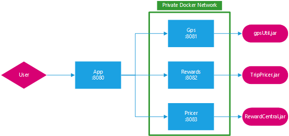

# TourGuide



## Présentation du projet

Notre solution permet de rendre simple et ludique les visites touristiques.

En effet, TourGuide propose des attractions, des lieux touristiques et des billets de spectacles proches de votre
position actuelle. En allant à ces attractions, les utilisateurs gagnent des réductions sur leurs prochaines visites.

Grâce à notre réseau d'agence de voyage, nous proposons des séjours et activités qui correspondent à tous les critères
des clients. (Nombres d'enfants, Prix, Durée du séjour, ...)

## Pré-requis

 - Docker & docker-compose
 - Java 11
 - Pandoc (documentation)

## Lancement du projet

```bash
docker-compose build
docker-compose up
```

## Génération de la Documentation (Pandoc)

```bash
pandoc doc/doc.md -f gfm  -t docx -s -o doc/doc.docx
```
