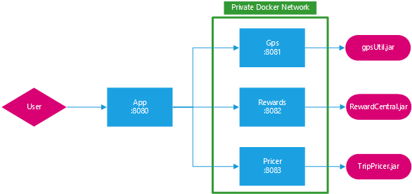

# 1. Présentation du projet

Notre solution permet de rendre simple et ludique les visites touristiques.

En effet, TourGuide propose des attractions, des lieux touristiques et des billets de spectacles proches de votre
position actuelle. En allant à ces attractions, les utilisateurs gagnent des réductions sur leurs prochaines visites.

Grâce à notre réseau d'agence de voyage, nous proposons des séjours et activités qui correspondent à tous les critères
des clients. (Nombres d'enfants, Prix, Durée du séjour, ...)

## 1.1 Objectif du projet

Les objectifs du projet sont de proposer un service web qui supporte un nombre important d'utilisateurs simultanés avec
une expérience simple et fluide.

Nous avons pour but de supporter 100 000 utilisateurs en même temps. Pour cela nous devons mettre l'accent sur la
performance et la stabilité.

Avec une expérience utilisateur ludique et agréable, nous avons comme objectifs d'attirer de nouveaux utilisateurs tous
les mois et de les convertir en utilisateurs réguliers.

## 1.2 Hors du champ d’application

L'ajout d'une fonctionnalité de navigation, comme [Google Map](https://www.google.com/maps), a été envisagée, mais cela
demande des compétences techniques précises et cela aurait un impact sur la complexité de l'application.

Cependant, nous pouvons utiliser les API fournies par ces services. Ce qui permettrait d'ajouter ces fonctionnalités
avec un cout moindre.

## 1.3 Mesure du projet

Les principaux facteurs à surveiller sont :

- Le nombre d'utilisateurs récurrents (qui visitent au moins une attraction tous les mois)
- Le nombre de nouveaux inscrits par mois
- Le pourcentage des nouveaux inscrits qui deviennent des utilisateurs récurrents.
- Les métriques de performances lors des pics d'utilisateurs.
- Nombre de téléchargements et les avis sur les différents "Stores". Exemple
    - [Google Play Store](https://play.google.com/store)
    - [Apple Store](https://www.apple.com/store)
    - [Microsoft Store](https://www.microsoft.com/en-us/store/apps/windows)

# 2. Caractéristiques

## 2.1 Fonctionnalités

- **Proposer** des offres de voyage qui correspondent aux critères des utilisateurs
- **Recommander** les attractions pertinentes les plus proches de chaque utilisateur
- **Collecter** toutes les positions des utilisateurs afin de les visualiser

## 2.2 User Stories

- En tant qu'**utilisateur**,
- Je veux **avoir des recommandations sur les attractions proches de moi**
- Afin de **les visiter**

---

- En tant qu'**utilisateur**,
- Je veux **obtenir une récompense lorsque je visite une attraction**
- Afin de **d'avoir des réductions sur d'autres attractions**

---

- En tant qu'**utilisateur**,
- Je veux **me voir proposer des offres de séjours adaptées à mes critères**
- Afin de **pouvoir faire des attractions qui me correspondent**

---

- En tant qu'**utilisateur**,
- Je veux **pouvoir utiliser les récompenses que j'ai reçues**
- Afin de **bénéficier de réductions sur les séjours et billets de spectacle**

---

- En tant qu'**analyste**,
- Je veux **récupérer la position de tous les utilisateurs en temps réels**
- Afin de **les visualiser**

---

- En tant qu'**analyste**,
- Je veux **récupérer les métriques de performances**
- Afin de **les analyser**

## 2.3 Critères d'acceptations

- Scenario : **l'utilisateur veut créer un compte sur l'application**
- Étant donné que **l'utilisateur ne possède pas de compte**
- Lorsque **il saisit son email et son mot de passe et ses informations personnelles**
- Alors **le système lui créer un nouveau compte* après confirmation de son adresse email**

---

- Scenario : **l'utilisateur se connecte pour accéder à l'application**
- Étant donné que **l'utilisateur possède déjà un compte et qu'il est déconnecté**
- Lorsque **il saisit son email et son mot de passe**
- Alors **le système le connecte et il peut accéder aux fonctionnalités**

---

- Scenario : **récupération de la position de l'utilisateur**
- Étant donné que **l'utilisateur est connecté sur l'application**
- Lorsque **l'utilisateur se déplace**
- Alors **le système récupère sa position GPS et l'a sauvegarde**

---

- Scenario : **obtention d'une récompense lorsqu'un utilisateur visite une attraction**
- Étant donné que **l'utilisateur est connecté et qu'il est proche d'une attraction référencée**
- Alors **le système lui donne une récompense**

---

- Scenario : **propositions de séjours de voyages**
- Étant donné que **l'utilisateur est connecté sur l'application**
- Lorsque **l'utilisateur choisit des critères de séjours (Nombres d'enfants, Prix, Durée du séjour, ...)**
- Alors **le système lui liste la liste des séjours qui correspondent**

---

- Scenario : **utilisation des récompenses**
- Étant donné que **l'utilisateur a déjà reçu au moins une récompense**
- Lorsque **l'utilisateur choisit d'utiliser une récompense**
- Alors **le système lui envoie un code de réduction et marque la récompense comme étant utilisée**

---

- Scenario : **visualisation de la position de tous les utilisateurs**
- Étant donné que **l'utilisateur connecté est un analyste**
- Lorsque **l'utilisateur clique sur le bouton de visualisation**
- Alors **le système lui affiche une carte avec les positions de tous les utilisateurs en temps réel**

# 3. Solution proposée

## 3.1 Schémas de conception technique

## 3.2 Glossaire

- Attraction : points d'intérêts, lieux touristiques, événements, parcs d'attractions, ...
- Utilisateur : compte inscrit sur TourGuide et qui utilise le service
- Récompense : réductions ou prix avantageux pour des séjours ou des spectacles
- Position GPS : positionnement sur la carte mondiale, notamment obtenue avec des satellites
- Conteneur : environnement séparé et maitrisé dans lequel s'exécute une application
- Asynchrone : permet à un système d'effectuer plusieurs tâches de façon concurrente
- Ecosystème : projets réutilisables autour d'un domaine

## 3.3 Spécifications techniques

Aujourd'hui beaucoup de languages et frameworks sont disponibles pour créer des solutions web.

Le Java et le framework SpringBoot sont très matures et de confiance. En effet, le framework Spring Boot possède une
communauté active et un écosystème très large. Et il est facile de trouver des personnes compétentes dans ce domaine.

Pour avoir une meilleure séparation des différentes parties de l'application, nous proposons d'utiliser l'architecture
micro-service. Aujourd'hui, Docker est incontournable dans ce domaine, car il permet de déployer plusieurs micro-service
avec une seule commande dans un environment maitrisé. [Docker](https://www.docker.com/)
& [docker-compose](https://docs.docker.com/compose/).

## 3.4 Solutions alternatives

Compte tenu des objectifs de performances du projet, il serait intéressant de prendre en compte des languages qui ont un
support de l'asynchrone solide. On peut notamment parler de :

- Rust avec [Tokio.rs](https://tokio.rs/)
- Go avec les [Goroutines](https://go.dev/tour/concurrency/1)

Mais ces languages sont relativement jeunes (par rapport à Java), et il est donc plus difficile de trouver des personnes
compétentes.

Pour la conteneurisation, il existe des alternatives à Docker, qui ont d'autres avantages. On peut
citer [Podman](https://docs.podman.io/en/latest/index.html), qui permet de lancer des conteneurs en mode rootless, ce
qui est considéré comme plus sûr. Cependant, ce projet est moins utilisé et possède un écosystème plus réduit.

## 3.5 Calendrier prévisionnel et exigences

Pour assurer la réussite du projet, nous avons fixées des exigences :

- La couverture des tests unitaires doit être de 75% ;
- Tous les tests unitaires doivent être stables : surtout lors d'accès concurrents ;
- Respecter les critères des utilisateurs pour la sélection des séjours proposés ;

Nous avons pour objectifs de supporter 100 000 utilisateurs simultanés. Pour vérifier ces exigences, nous nous sommes
fixés des contraintes de performances.

- La partie GPS doit pouvoir obtenir 100 000 emplacements d'utilisateurs dans un délai de 15 minutes.
- La partie récompenses doit pouvoir obtenir des récompenses pour 100 000 utilisateurs dans un délai de 20 minutes.